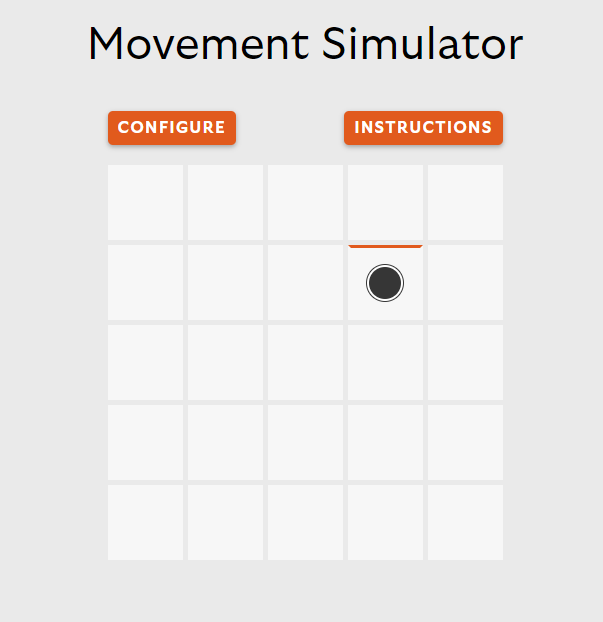

# Movement Simulator
[Playground](https://movement-simulator.vercel.app/)

This is an experimental project that attempts to align its appearance with a specific website through its implementation of a simple yet interesting interactive functionality. A droid will be placed inside a cellular structure and the user will be provided control to that bot to move it around that structure.


*A bot placed in the 2nd row of the 4th column facing upward (north)* 

## Getting Started

Execute the following commands -

```bash
git clone https://github.com/salman0719/movement-simulator.git
cd movement-simulator
npm install
npm run dev
```

Open [http://localhost:3000](http://localhost:3000) in you browser. Once loaded, start pressing the arrow keys to see the droid in action.
